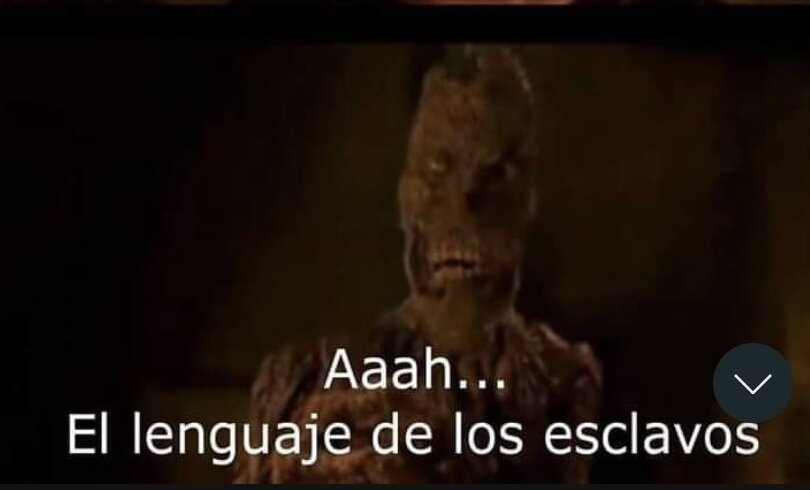
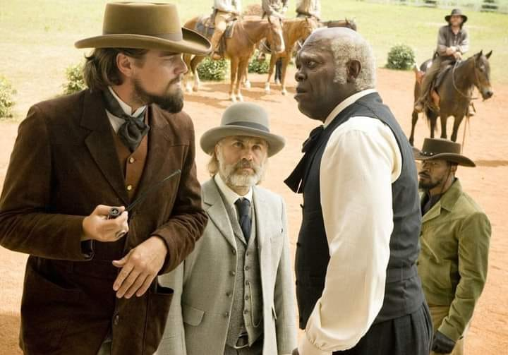

>Lo que pasa es que tu no lo ves de esa forma. Pero la esclavitud está mas vigente que nunca.

Hoy fuí al gimnasio, y una muchacha me comentaba que trabajaba de 9 am a 7 pm, sin prestaciones de ningún tipo (ella nisiquiera sabía en que tipo de contrato estaba).

Ahora veo un post de otra muchacha que estudió una carrera y dos maestrías (eso fue un error) para aspirar a un salario decente. Está ganando el mínimo y le dió alopecia por el estrés.

Bueno bueno, así funciona el mercado me dirán. Si, así funciona, pero echémosle tres dedos de frente. **¿Que es la esclavitud?**. Pues la esclavitud es tener a alguien trabajando sin pagarle y limitandole la libertad, donde el patrón lo defina. Bien, creo que eso no existe mas. O bueno, en realidad el patrón debía asumir costos de alimentación y "cuidado" de los esclavos, así que podemos decir que los patrones les daban en cierto sentido un sueldo a sus esclavos, que era el mínimo para subsitir.

Ahora. Las cosas han cambiado un poco, ahora puedes decidir si trabajas o no para un patrón, y hay "leyes" que te protegen, supuestamente. (Los asesores muchas veces te dicen que no denuncies ante injusticias, que dejes las cosas así). Y se supone que te deben dar un salario mínimo que te debe dar para vivir, pero en realidad es para sobrevivir.

Ok, pero no seamos tan rudos. En realidad hay muchas mas comodidades que antes, ahora puedes comprarte un celular, o planear un viaje a créditos, o pagar a cuotas los medicamentos para la alopecia que te generó el estrés. Mira, aquí tengo que pararte, porque estás hablando el lenguaje de los esclavos.

  {:style="display: block; margin-left: auto; margin-right: auto; max-width: 50%; height: auto;"}
  
El estilo de vida cambió y el mínimo vital cambió, los precios de vivienda subieron, y hay que pagar servicios, eso significa que debes ganar mucho mas para vivir, y el salario mínimo cubre lo básico. En otras palabras, cubre lo que el patrón le cubría a sus esclavos, con la comodidad para el patrón, de que ahora tu te vas por tu cuenta y ves que haces.

Hay otros temas por ahí. Usualmente quien gana un salario mínimo no puede negociar, o denunciar, porque lo pone en situaciones aún peores.

Para el 2022 la mitad de los colombianos [recibe el salario mínimo o menos](https://www.infobae.com/america/colombia/2022/12/06/el-431-de-los-trabajadores-recibe-menos-del-salario-minimo-en-colombia/), y el 43% menos del salario mínimo en sus trabajos. Es decir, la mitad del país está teniendo el dinero suficiente para no morir.

Ahora, ves tu a ver. Lo que pasa es que tienes que ir a ver y a echarle un ojito al tema, y hablarlo. La gente se acostumbra al trabajo pesado y a ganar poco, y lo justifica. Lo justifican los CEOs en linkedin y lo justifican los trabajadores de los CEOs y de ahí pa abajo todo el mundo, porque las cosas hay que ganarselas... porque echando pa alante es que el CEO levantó los millones, y así si ganas el salario mínimo pues has de estar haciendo el mínimo, o sino fueras el CEO, ¿no?.

La verdad, la verdad verdad es que esta gente que vive así, cuando hablas con ellos son unas cosas brutales, trabajan jornadas de 12 horas, de lunes a sábado, sin ningún tipo de prestaciones, con familias que mantener, se levantan antes de 5am [^1], se ponen la camiseta, sacan al trabajo a andar, mejor dicho, hacen todo lo que un multimillonario dijo que hizo para hacerse rico, excepto una cosa: Están convencidos de que ganan lo justo y de que la vida es y ha sido así de dura siempre.

Osea, te la pongo simple:

> La economía mundial está siendo mantenida por esclavos.

Porque aunque el CEO de X compañía levante 1 billón de dolares con su nuevo producto, en la cadena de producción, la verdad es que el la mitad de las personas que directa o indirectamente han contribuido a eso **son esclavos**.

Lo que pasa es que tu no lo ves. Porque te ha dado duro la idea de que te lo has ganado todo y ya no frecuentas los mismos sitios que antes, y no sabes que al man que le pagaste la propina en el restaurante, le están pagando con eso, y lleva desde 7am llevando pedidos y ya le duelen las manos.

La esclavitud no se ha ido, solo le cambiamos el nombre. Aún puedes ir mas abajo, hay cosas peores, pero esta *la parte que sabemos que sabemos*.

# Bueno y que hacemos dotor

Lo primero en todo paso es el reconocimiento. Puro y duro, **no hemos abolido ninguna esclavitud**, y si es necesario, **soy un esclavo y no merezco estar en esta posición**. No seas como Stephen, el de la película [Django sin cadenas](https://www.imdb.com/title/tt1853728/), porque ahí inicia todo.

{:style="display: block; margin-left: auto; margin-right: auto; max-width: 50%; height: auto;"}

Lo siguiente es empezar a ver que hacemos para abolir la esclavitud. Denunciar es una opción, unirse con otros trabajadores en situaciones similares es otra, pero sobre todo, ayudar a los de abajo, a los que están en situaciones precarias a entender que están en situaciones de desventaja y antinaturales.

Podemos empezar por ahí. No se. no te puedo dar todas las soluciones, pero no me vengas con el cuento de que, **la esclavitud ya no existe bro, es un logro de la humanidad**. 

## Footnotes
[^1]: Como en el libro "el club de las 5 de la mañana"
